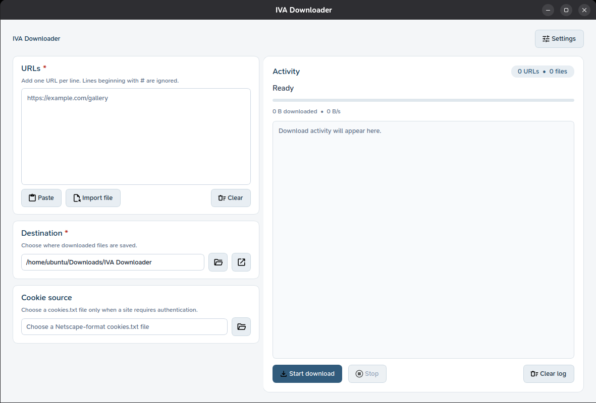
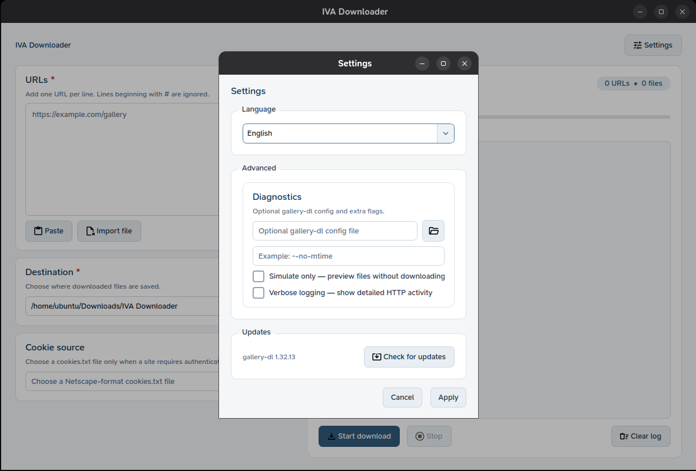

<div align="center">

# IVA Downloader

**A modern desktop GUI for [gallery-dl](https://github.com/mikf/gallery-dl)**  
Download images and galleries from 300+ sites — with a clean interface, live output, and zero terminal work.

[](https://www.python.org/)
[](https://doc.qt.io/qtforpython/)
[](https://github.com/mikf/gallery-dl)
[](.)
[](pyproject.toml)

<br/>

<table>
  <tr>
    <td align="center"><strong>Main window</strong><br/></td>
    <td align="center"><strong>Settings</strong><br/></td>
  </tr>
</table>

</div>

---

## Features

**Inputs**
- **Paste or type** URLs directly — one per line
- **Import from file** — load a `.txt` list of URLs in one click
- **Comment support** — lines starting with `#` are silently skipped
- **Duplicate warning** — remove repeated URL lines and download each link once, or confirm every occurrence
- **Cookie file** — point to a Netscape-format `cookies.txt` for sites requiring login

**Controls**
- **Custom destination** — pick any output folder, with a quick "open in explorer" button
- **Settings dialog** — configure advanced options and choose English, Vietnamese, Japanese, or Chinese
- **Apply or cancel** — review settings changes before applying them
- **Update gallery-dl** — see the installed version and upgrade gallery-dl without leaving the app

**Activity panel**
- **Live log** — colour-coded output streams in real time (info, success, warning, error)
- **Task progress** — highlights the active URL, completed URLs, failures, and remaining count
- **Batch counter** — tracks URLs submitted and files downloaded
- **Stop anytime** — graceful terminate with a 3-second kill fallback
- **Transfer stats** — track downloaded files, total size, and average transfer speed

**UX**
- **Persistent settings** — applied options and last-used paths are remembered between sessions
- **Polished light theme** — Qt Fusion palette with a custom stylesheet and SVG icons
- **Fixed two-panel layout** — setup on the left, activity on the right

---

## Getting started

> **Requires Python 3.10+.** Install [Python](https://www.python.org/downloads/) if you don't have it yet.

### Linux

```bash
python3 -m venv .venv
.venv/bin/python -m pip install -r requirements.txt
./run.sh
```

### Windows — PowerShell / Command Prompt

```powershell
py -m venv .venv
.\.venv\Scripts\python.exe -m pip install -r requirements.txt
.\.venv\Scripts\python.exe gallery_dl_gui.py
```

## Quick guide

1. Open IVA Downloader using the launcher for your operating system.
2. Paste or type one gallery URL per line in the **URLs** box. Lines starting with `#` are treated as comments.
3. Choose a **Destination** folder for downloaded files. Add a cookies file only if the site requires you to sign in.
4. Select **Start download**. If URLs are repeated, choose **Skip duplicates** to download each URL once, or **Download duplicates** to download every occurrence.
5. Follow each URL's status in the **Activity** panel. Select **Stop** to halt the current batch.

Use **Settings** for language, advanced gallery-dl options, and updates. Select **Apply** to save changes; **Cancel** discards changes that have not been applied.

### Supported languages

The **Language** selector in Settings offers:

- English
- Tiếng Việt (Vietnamese)
- 日本語 (Japanese)
- 中文 (Chinese, Simplified)

## Dependencies

| Package | Version | Role |
|---|---|---|
| [gallery-dl](https://github.com/mikf/gallery-dl) | ≥ 1.32 | Download engine |
| [PySide6](https://doc.qt.io/qtforpython/) | 6.11.x | Qt GUI bindings |

Dev only: `pytest ≥ 9`, `pytest-qt ≥ 4.5`
