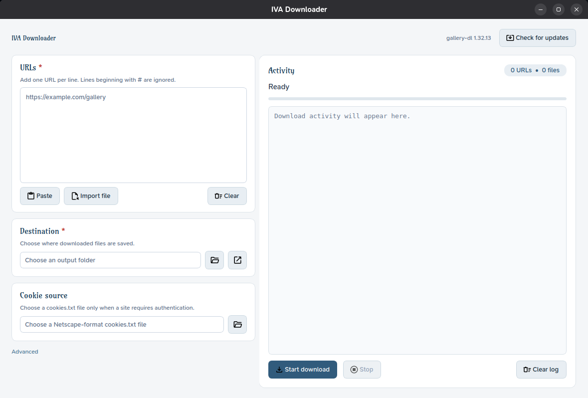

<div align="center">

# IVA Downloader

**A modern desktop GUI for [gallery-dl](https://github.com/mikf/gallery-dl)**  
Download images and galleries from 300+ sites — with a clean interface, live output, and zero terminal work.

[](https://www.python.org/)
[](https://doc.qt.io/qtforpython/)
[](https://github.com/mikf/gallery-dl)
[](.)
[](pyproject.toml)

<br/>



</div>

---

## Features

**Inputs**
- **Paste or type** URLs directly — one per line
- **Import from file** — load a `.txt` list of URLs in one click
- **Comment support** — lines starting with `#` are silently skipped
- **Duplicate warning** — remove repeated URL lines and download each link once, or confirm every occurrence
- **Cookie file** — point to a Netscape-format `cookies.txt` for sites requiring login

**Controls**
- **Custom destination** — pick any output folder, with a quick "open in explorer" button
- **Advanced panel** — optional config file, extra CLI flags, simulate mode, verbose logging
- **Update gallery-dl** — upgrade the bundled downloader without leaving the app

**Activity panel**
- **Live log** — colour-coded output streams in real time (info, success, warning, error)
- **Task progress** — highlights the active URL, completed URLs, failures, and remaining count
- **Batch counter** — tracks URLs submitted and files downloaded
- **Stop anytime** — graceful terminate with a 3-second kill fallback
- **Transfer stats** — track downloaded files, total size, and average transfer speed

**UX**
- **Persistent settings** — last-used paths and options are remembered between sessions
- **Polished light theme** — Qt Fusion palette with custom stylesheet, SVG icons, and a brand font
- **Fixed two-panel layout** — setup on the left, activity on the right

---

## Getting started

> **Requires Python 3.10+.** Install [Python](https://www.python.org/downloads/) if you don't have it yet.

### Linux

```bash
python3 -m venv .venv
.venv/bin/python -m pip install -r requirements.txt
./run.sh
```

### Windows — PowerShell / Command Prompt

```powershell
py -m venv .venv
.\.venv\Scripts\python.exe -m pip install -r requirements.txt
.\.venv\Scripts\python.exe gallery_dl_gui.py
```

---

## Project layout

```
gallery-dl-gui/
│
├── gallery_dl_gui.py        ← entry point
├── run.sh                   ← Linux launcher
├── run.bash                 ← Windows (Git Bash) launcher
├── requirements.txt         ← runtime deps
├── pyproject.toml           ← project metadata & test config
│
├── iva_downloader/          ← application package
│   ├── app.py               ← QApplication setup & light theme
│   ├── ui.py                ← MainWindow, all widgets & signals
│   ├── command.py           ← builds the gallery-dl CLI command
│   ├── runner.py            ← QProcess wrapper with Qt signals
│   ├── models.py            ← DownloadSettings dataclass & validation
│   ├── settings.py          ← JSON persistence (~/.gallery_dl_gui.json)
│   ├── resources.py         ← asset loading helpers (icons, fonts)
│   └── assets/
│       ├── fonts/           ← bundled typefaces
│       ├── icons/           ← Material Symbols SVG / ICO
│       └── licenses/        ← third-party license texts
│
└── tests/                   ← pytest suite
    ├── test_app.py
    ├── test_command.py
    ├── test_models.py
    ├── test_resources.py
    ├── test_runner.py
    ├── test_settings.py
    ├── test_theme.py
    └── test_ui.py
```

---

## How it works

```
┌─────────────────────────────┐     ┌────────────────────────────────┐
│        Setup panel          │     │        Activity panel          │
│                             │     │                                │
│  URLs (one per line)        │     │  Live coloured log output      │
│  Destination folder         │──►  │  Per-URL status and progress   │
│  Cookie file (optional)     │     │  Downloaded / remaining counts │
│  Advanced: config, flags,   │     │  Start / Stop buttons          │
│  simulate, verbose          │     │                                │
└─────────────────────────────┘     └────────────────────────────────┘
              │                                    ▲
              │  build_command()                   │ Qt signals
              ▼                                   │
       gallery-dl CLI args          DownloadRunner (QProcess)
              │                          streams merged stdout
              └──────────────────────────────────►│
```

Settings are auto-saved to `~/.gallery_dl_gui.json` on every successful download start.

---

## Running the tests

```bash
# install dev extras once
.venv/bin/python -m pip install -e '.[dev]'

# run the full suite
.venv/bin/python -m pytest
```

> On Windows swap `.venv/bin/python` for `.venv\Scripts\python.exe`.

---

## Dependencies

| Package | Version | Role |
|---|---|---|
| [gallery-dl](https://github.com/mikf/gallery-dl) | ≥ 1.32 | Download engine |
| [PySide6](https://doc.qt.io/qtforpython/) | 6.11.x | Qt GUI bindings |

Dev only: `pytest ≥ 9`, `pytest-qt ≥ 4.5`
